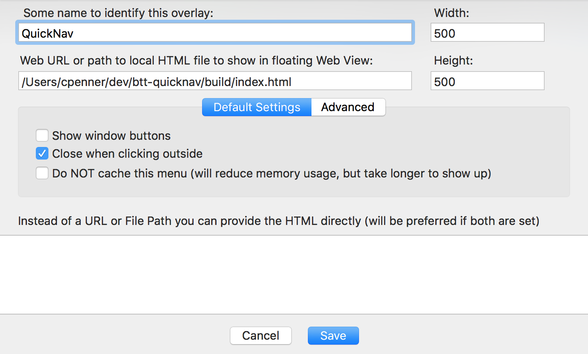
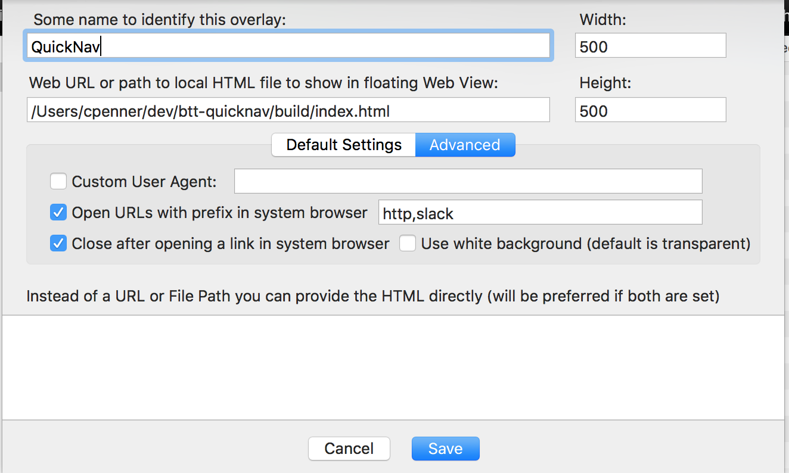

Better Touch Tool Quick-navigator
=================================

A quick navigator to automate your workflow;

Currently has commands to help you:

- Jump to bookmarks
- Open browser sessions (or presets)
- Open slack channels
- Run bash commands
- Run arbitrary Better Touch Tool commands

## Installation

- `git clone https://github.com/ChrisPenner/btt-quicknav.git`
- `cd btt-quicknav`
- `npm install`

## Setup

In order to use quick-nav you'll need to set it up with whatever commands or configuration you like.

The config files are gitignored, but there are examples which you can use to get started:

- `cp example-secrets.json ./src/secrets.json` 
- Here you can configure secrets/api tokens for services you use
- `cp example-config.json ./src/config.json` 
- Here you can set up basic setting  which can be used by commands
- `cp example-command-config.json ./src/command-config.json` 
- Here you can configure which commands will be available or add your own commands

## Running

- `npm run build`: You'll need to set up your config files for this to succeed
- Add a new html overlay on some keyboard shortcut inside BTT

Basic settings:

Advanced settings:

